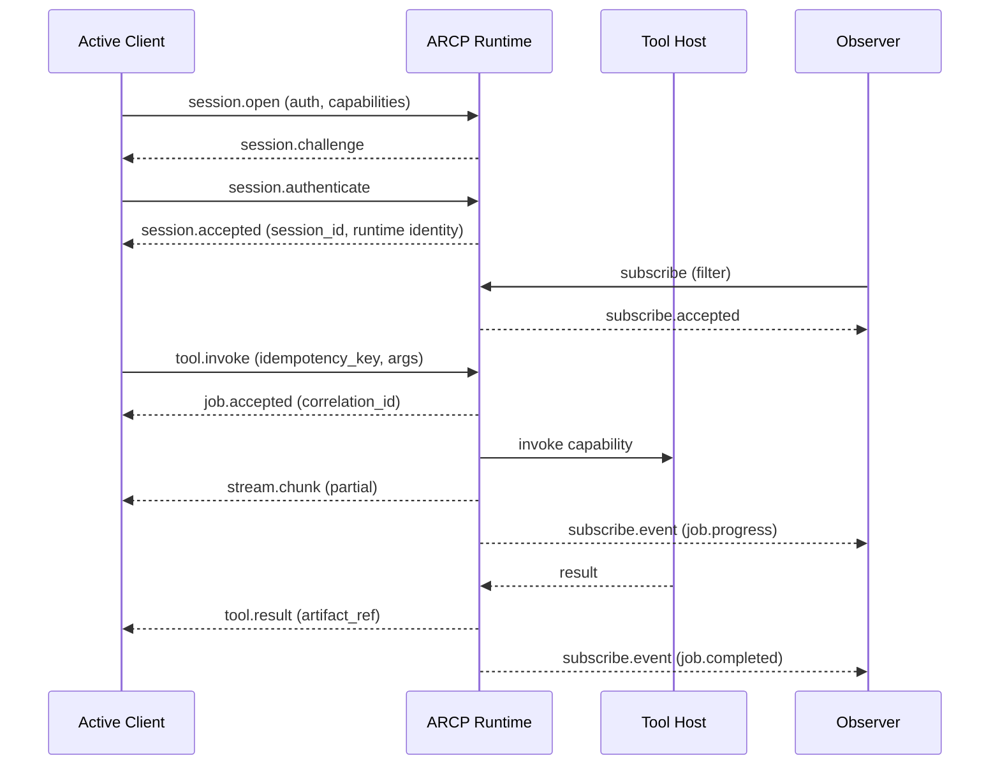
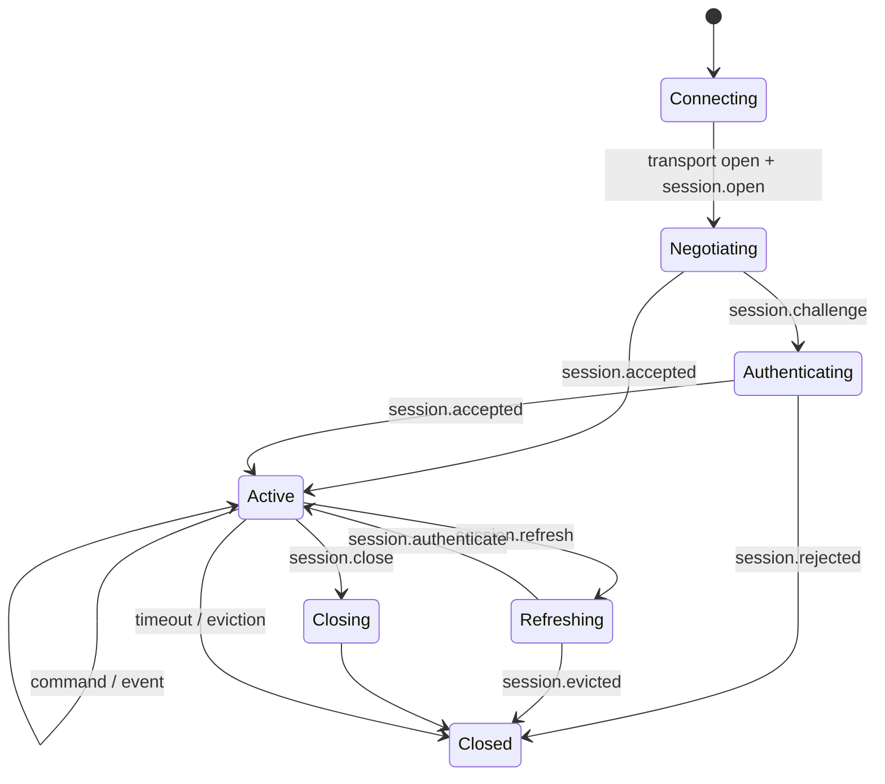

# ARCP — Agent Runtime Control Protocol

> A transport-agnostic, schema-first protocol for secure, observable, streaming-native execution of tools, jobs, workflows, and agent-to-agent interactions.

<p align="center">
  
  
  
</p>

---

## TL;DR

ARCP is a transport-agnostic JSON wire protocol for _running_ agents, not just describing them.

- **Where it fits:** MCP says _what tools exist_; ARCP says _how execution happens_ — sessions, jobs, streams, cancellation, resumability, audit.
- **Core primitives:** authenticated sessions, durable jobs with heartbeats/checkpoints, typed streams (text/binary/event/log/metric/thought), cooperative `cancel` + `interrupt`, lease-scoped permissions, first-class human-in-the-loop (`human.input.request`, `human.choice.request`), addressable artifacts, read-only observer subscriptions, agent-to-agent delegation/handoff with shared `trace_id`.
- **Wire shape:** one canonical envelope (`arcp`, `id`, `type`, `session_id`, `trace_id`, `payload`, ...). Two idempotency keys: `id` (transport) and `idempotency_key` (logical intent across reconnects).
- **Transports:** WebSocket + stdio mandatory; HTTP/2, QUIC, MQ optional. Same semantics on all of them.
- **Built-in batteries:** canonical error taxonomy (`PERMISSION_DENIED`, `HEARTBEAT_LOST`, `LEASE_EXPIRED`, ...), reserved metric names (`tokens.used`, `cost.usd`, `latency.ms`, ...), W3C trace propagation, namespaced extension mechanism.
- **Status:** Draft (Rev 2), spec v1.0, 11 reference SDKs (TS, Python, Go, Rust, Java, Kotlin, Swift, Ruby, PHP, C#, F#).

One-line motto: **MCP describes capabilities. ARCP operationalizes them.**

---

## Table of Contents

1. [Overview](#overview)
2. [Motivation](#motivation)
3. [Status & Maturity](#status--maturity)
4. [Design Principles](#design-principles)
5. [Core Concepts](#core-concepts)
6. [Architecture](#architecture)
7. [Specification](#specification)
   - [Versioning](#versioning)
   - [Transport](#transport)
   - [Message Format](#message-format)
   - [Identity & Authentication](#identity--authentication)
   - [Session Lifecycle](#session-lifecycle)
   - [Capability Discovery](#capability-discovery)
   - [Tool & Action Invocation](#tool--action-invocation)
   - [Context, Memory & State](#context-memory--state)
   - [Streaming & Async Semantics](#streaming--async-semantics)
   - [Error Handling](#error-handling)
   - [Multi-Agent Coordination](#multi-agent-coordination)
   - [Human-in-the-Loop](#human-in-the-loop)
   - [Observability & Tracing](#observability--tracing)
8. [Security Model](#security-model)
9. [Reference Implementation](#reference-implementation)
10. [Installation](#installation)
11. [Quick Start](#quick-start)
12. [Examples](#examples)
13. [SDKs & Clients](#sdks--clients)
14. [Compatibility & Interoperability](#compatibility--interoperability)
15. [Comparison with Other Protocols](#comparison-with-other-protocols)
16. [Performance & Scaling](#performance--scaling)
17. [Conformance Testing](#conformance-testing)
18. [Roadmap](#roadmap)
19. [Governance](#governance)
20. [Contributing](#contributing)
21. [Code of Conduct](#code-of-conduct)
22. [FAQ](#faq)
23. [Glossary](#glossary)
24. [References](#references)
25. [License](#license)

---

## Overview

ARCP (Agent Runtime Control Protocol) is a wire-level interaction specification that defines how clients, agent runtimes, tool hosts, and observers exchange messages in order to execute tools, run durable jobs, coordinate multi-agent workflows, and maintain human oversight — all while preserving streaming, cancellation, resumability, and audit guarantees that today's agent stacks bolt on inconsistently or not at all.

The actors are **active clients** (which issue commands), **runtimes** (which execute work and emit events), **observers** (which subscribe read-only to event streams), **tool hosts** (which execute capabilities behind the runtime), and **humans** (who answer typed input and approval requests through first-class protocol primitives). ARCP defines the envelopes, lifecycles, and contracts that bind these actors together.

What makes ARCP different is that it is deliberately a _runtime_ protocol, not a _capability discovery_ protocol. MCP describes _what_ exists; ARCP describes _how execution occurs_ — including the semantics of cancellation, heartbeats, leases, replay, and human input that capability-only protocols leave as exercises for the implementer.

**At a glance:**

- **Layer:** Application layer; sits above any bidirectional byte stream.
- **Encoding:** JSON envelopes (canonical schema; binary sidecar frames optional on supporting transports).
- **Transport(s):** WebSocket, stdio (mandatory); HTTP/2, QUIC, Unix sockets, named pipes, message queues (recommended).
- **Statefulness:** Sessions MAY be stateless, stateful, or durable.
- **Trust model:** Authenticated by default. Schemes: `bearer`, `mtls`, `oauth2`, `signed_jwt`. Permissions materialize as time-boxed leases.
- **Reference implementations:** SDKs in TypeScript, Python, Go, Rust, Java, Kotlin, Swift, Ruby, PHP, C#, F#.

---

## Motivation

### Problem Statement

Agent runtimes today re-implement the same primitives — streaming, cancellation, heartbeats, durable jobs, human approval, audit, multi-agent handoff — in mutually incompatible ways. The result is that a tool host written for one runtime cannot be observed, federated with, or substituted for one written for another, and that operationally critical concerns (auth, retention, leases, replay) are left to ad-hoc per-vendor conventions.

ARCP's premise is that the _capability_ layer (what tools exist and what their schemas are) is largely solved by MCP and equivalents, but the _execution_ layer (how those capabilities are invoked, observed, paused, cancelled, retried, audited, and federated) is not. ARCP fills exactly that gap.

### Why a New Protocol?

| Existing Approach                     | What It Does Well                                       | Where It Falls Short for Runtime Control                                                                                                                           |
| ------------------------------------- | ------------------------------------------------------- | ------------------------------------------------------------------------------------------------------------------------------------------------------------------ |
| MCP                                   | Capability discovery, tool schemas, resources, prompts. | No durable jobs, no streaming contract beyond resources, no cancellation taxonomy, no first-class human-in-the-loop, no lease-scoped permissions, no resumability. |
| JSON-RPC 2.0                          | Simple request/response framing.                        | No streaming, no sessions, no events, no auth, no traceability beyond `id`/result.                                                                                 |
| OpenAI Assistants / vendor agent APIs | Hosted runtimes with assistants, threads, tool calls.   | Vendor-specific, not transport-agnostic, no peer federation, opaque to external observers.                                                                         |
| A2A / agent-to-agent prototypes       | Peer agent messaging.                                   | Underspecified runtime semantics; no canonical error model, lease lifecycle, or replay contract.                                                                   |
| gRPC + custom services                | Strong typing, bidi streams.                            | Reinvents sessions/auth/observers per project; no shared error or metric vocabulary across runtimes.                                                               |

### Non-Goals

- LLM prompt formats.
- Vector database standards.
- Model architectures.
- Tool schema formats (delegated to MCP and equivalents).
- UI rendering systems.
- Authentication provider implementations (ARCP defines the exchange shape; not who issues credentials).
- Persistence engine requirements.

ARCP MAY integrate with all of these; it does not redefine them.

---

## Status & Maturity

| Field                                | Value                                                                                                                       |
| ------------------------------------ | --------------------------------------------------------------------------------------------------------------------------- |
| **Spec version**                     | 1.0                                                                                                                         |
| **Status**                           | Draft (Revision 2)                                                                                                          |
| **Stability guarantee**              | Wire-format breaking changes require a major version bump. Extensions evolve under their own namespaces (§21).              |
| **Last reviewed**                    | 2026-05-10                                                                                                                  |
| **Editors**                          | Nick Ficano et al.                                                                                                          |
| **Implementations known to interop** | TypeScript, Python, Go, Rust, Java, Kotlin, Swift, Ruby, PHP, C#, F# reference SDKs (see [SDKs & Clients](#sdks--clients)). |

> **Stability disclaimer:** Revision 2 is a draft. Wire shapes for core message types (envelope, session handshake, job lifecycle, streams, leases, artifacts, errors) are intended to remain stable through the 1.x line, but any field MAY shift before the spec exits draft. Pin to a spec version and exercise the conformance suite before depending on cross-runtime interop.

---

## Design Principles

1. **Transport agnostic.** Identical semantics over stdio, WebSocket, HTTP/2, QUIC, Unix sockets, named pipes, and message queues. Tying the protocol to a single transport limits adoption and forces re-implementation per environment.
2. **Streaming native.** Streams are first-class — text, binary, structured events, logs, metrics, and reasoning all use the same envelope and backpressure contract. Bolting streaming onto a request/response core produces inconsistent partial-result handling.
3. **Authenticated by default.** Sessions MUST NOT carry traffic before authentication completes; anonymous mode is a negotiated capability, not a default. This eliminates the most common operational footgun in agent runtimes.
4. **Durable and resumable.** Long-running jobs persist, heartbeat, checkpoint, and resume across reconnects. Without this, "agent runtimes" are really just RPC servers with prose.
5. **Capability-explicit.** Both sides advertise what they support and treat absent capabilities as `false`. Unknown messages are rejected loudly, not silently absorbed, except where explicitly marked optional.
6. **One vocabulary for errors and metrics.** A canonical error code taxonomy (§18) and reserved metric names (§17.3.1) make dashboards and alerts portable across runtimes.
7. **Auditable by default.** Trace IDs, causation IDs, and observer subscriptions are core, not bolted-on. Every state transition is replayable.
8. **Boring on the wire.** JSON envelopes, RFC 3339 timestamps, W3C Trace Context conventions. Novelty is reserved for the runtime semantics, not the bytes.

---

## Core Concepts

### Agent

An autonomous system capable of executing work on behalf of a principal. An agent participates in ARCP either as a client (issuing commands), as a runtime (executing them), or as a peer (delegated to or handing off from another runtime).

### Runtime

The execution environment that implements ARCP — accepts authenticated sessions, schedules jobs, owns streams and artifacts, enforces leases, and emits the canonical event stream.

### Session

A stateful interaction scope established only after a successful authentication handshake. Sessions MAY be stateless, stateful, or durable; durable sessions persist across transport reconnects under the same `session_id`.

### Capability

A declared runtime feature, advertised at session establishment. Capabilities cover protocol options (`streaming`, `durable_jobs`, `human_input`, `artifacts`, `subscriptions`, `scheduled_jobs`, `binary_encoding`) and namespaced extensions.

### Message / Envelope

The canonical container for every protocol exchange. Every message carries `arcp` version, unique `id`, `type`, RFC 3339 `timestamp`, and a typed `payload`, plus optional `session_id`, `job_id`, `stream_id`, `subscription_id`, `trace_id`, `span_id`, `correlation_id`, `causation_id`, `idempotency_key`, and `priority`.

### Job

A durable asynchronous execution. Jobs progress through a typed state machine (`accepted` → `queued` → `running` → `completed`/`failed`/`cancelled`/...), emit heartbeats, support cooperative cancellation and interrupts, and may be resumed from checkpoints.

### Stream

An incremental data channel keyed to a `stream_id`, declaring a `kind` (`text`, `binary`, `event`, `log`, `metric`, `thought`). Streams support backpressure and may use either base64 in-envelope or transport-native sidecar binary frames.

### Lease

The materialized form of a granted permission — time-boxed, scoped to a resource and operation, refreshable, and revocable. Operations attempted with an expired or revoked lease fail with `PERMISSION_DENIED`.

### Artifact

An addressable, content-typed payload referenced by id (`artifact_id`, `uri`, `media_type`, `size`, `sha256`, `expires_at`) rather than transported inline. Used for results, shared memory, and large/binary outputs.

### Subscription

A read-only event feed established by an observer client, scoped by filter (`session_id`, `trace_id`, `types`, `min_priority`, ...) and authorized by the runtime.

### Trust Boundary

The seam between participants of differing trust levels (`untrusted`, `constrained`, `trusted`, `privileged`). Permission requests, leases, and trust elevation cross trust boundaries explicitly, with audit.

---

## Architecture

### System Diagram



### Components

| Component        | Responsibility                                                                                                 | Required?                                                  |
| ---------------- | -------------------------------------------------------------------------------------------------------------- | ---------------------------------------------------------- |
| Runtime          | Session lifecycle, job scheduling, stream management, lease enforcement, event emission.                       | Yes                                                        |
| Active Client    | Authenticates, issues commands (`tool.invoke`, `workflow.start`, `cancel`, ...), consumes results and streams. | Yes                                                        |
| Tool Host        | Executes capabilities behind the runtime; may be co-located or remote.                                         | Yes (logically; may be in-process)                         |
| Observer         | Holds subscriptions only; never issues commands. Powers dashboards, audit, debuggers.                          | Optional                                                   |
| Peer Runtime     | Federates via `agent.delegate` and `agent.handoff`, preserving `trace_id`.                                     | Optional                                                   |
| Human Channel(s) | Receives `human.input.request` / `human.choice.request`, returns responses.                                    | Optional (required if `human_input` capability advertised) |

### Layering

```text
+-----------------------------------------------------------+
|  Capability Layer (MCP-compatible: tool schemas, prompts) |
+-----------------------------------------------------------+
|  ARCP Runtime Layer                                       |
|  Identity & Sessions · Streams · Jobs · Subscriptions     |
|  Events · Permissions & Leases · Artifacts · Tracing      |
+-----------------------------------------------------------+
|  JSON envelopes (+ optional binary sidecar frames)        |
+-----------------------------------------------------------+
|  Transport: WebSocket / stdio / HTTP/2 / QUIC / MQ / ...  |
+-----------------------------------------------------------+
|  TLS (mandatory for network transports)                   |
+-----------------------------------------------------------+
|  TCP / IPC                                                |
+-----------------------------------------------------------+
```

---

## Specification

> The keywords **MUST**, **MUST NOT**, **REQUIRED**, **SHALL**, **SHALL NOT**,
> **SHOULD**, **SHOULD NOT**, **RECOMMENDED**, **MAY**, and **OPTIONAL** in
> this section are to be interpreted as described in [RFC 2119](https://datatracker.ietf.org/doc/html/rfc2119)
> and [RFC 8174](https://datatracker.ietf.org/doc/html/rfc8174).

The canonical normative source is [`spec/docs/RFC 0001  v2 — Agent Runtime Control Protocol.md`](../spec/docs/RFC%200001%20%20v2%20%E2%80%94%20Agent%20Runtime%20Control%20Protocol.md). This section is a faithful summary; in any conflict, the RFC governs.

### Versioning

- **Scheme:** SemVer 2.0.0 applied to the wire format. The `arcp` envelope field carries the spec version targeted by the sender.
- **Negotiation:** Clients propose capabilities in `session.open`; runtimes respond with the negotiated set in `session.accepted`. Required-but-unsupported features result in `session.rejected` with `code: UNIMPLEMENTED`.
- **Breaking change policy:** Any change that invalidates a previously valid envelope, message type, or required field requires a major version bump.
- **Deprecation window:** Promoted extensions MUST preserve wire compatibility for at least one revision (§21.4).

### Transport

ARCP is transport-agnostic. Each transport MUST preserve message body and delivery contract.

#### WebSocket (mandatory)

- Framing: one JSON envelope per text frame; binary sidecar frames keyed by `stream_id` permitted.
- Keepalive: transport-level ping/pong plus protocol-level `ping`/`pong`.
- Half-close: `bye` initiates graceful close; remaining in-flight terminal events SHOULD be drained.

#### stdio (mandatory)

- Framing: newline-delimited JSON (one envelope per line, no embedded newlines).
- Binary streams: MUST use base64 in-envelope encoding (no sidecar channel available).

#### HTTP/2, QUIC (recommended)

- Framing: one envelope per DATA frame group on a dedicated stream.
- Sidecar binary frames supported on QUIC and on HTTP/2 with negotiated extension; otherwise base64.

#### Message queues (optional)

- Framing: one envelope per message.
- Ordering: only guaranteed within a `stream_id` or `job_id` if the queue provides per-key ordering.

### Message Format

#### Envelope

```json
{
  "arcp": "1.0",
  "id": "msg_01JABC",
  "type": "job.progress",
  "session_id": "sess_123",
  "job_id": "job_456",
  "trace_id": "trace_789",
  "timestamp": "2026-05-07T21:30:00Z",
  "idempotency_key": "refund-ord_4812",
  "priority": "normal",
  "payload": {}
}
```

| Field             | Type   | Required    | Description                                                              |
| ----------------- | ------ | ----------- | ------------------------------------------------------------------------ |
| `arcp`            | string | MUST        | Protocol version understood by the sender.                               |
| `id`              | string | MUST        | Globally unique message id; transport-level idempotency key.             |
| `type`            | string | MUST        | Message type (core or namespaced extension).                             |
| `timestamp`       | string | MUST        | RFC 3339 sender timestamp.                                               |
| `session_id`      | string | conditional | Required once a session exists.                                          |
| `job_id`          | string | conditional | Required for durable job events.                                         |
| `stream_id`       | string | conditional | Required for stream events.                                              |
| `subscription_id` | string | conditional | Required for subscription delivery.                                      |
| `trace_id`        | string | SHOULD      | Stable id for a user-visible request or workflow.                        |
| `span_id`         | string | SHOULD      | Span id for the current operation.                                       |
| `parent_span_id`  | string | MAY         | Parent span id when part of a trace tree.                                |
| `correlation_id`  | string | MAY         | Id of the command this message answers.                                  |
| `causation_id`    | string | MAY         | Id of the message that directly caused this message.                     |
| `idempotency_key` | string | MAY         | Logical idempotency key for the command intent (see Delivery Semantics). |
| `priority`        | string | MAY         | One of `low`, `normal`, `high`, `critical`. Default `normal`.            |
| `extensions`      | object | MAY         | Namespaced extension fields (§21).                                       |
| `payload`         | object | MUST        | Type-specific body validated by the message schema.                      |

Receivers MUST treat message ids as transport idempotency keys: retried messages with the same `id` MUST NOT execute twice.

#### Message Types

**Identity & Authentication:** `session.open`, `session.challenge`, `session.authenticate`, `session.accepted`, `session.unauthenticated`, `session.rejected`, `session.refresh`, `session.evicted`, `session.close`.

**Control:** `ping`, `pong`, `ack`, `nack`, `cancel`, `cancel.accepted`, `cancel.refused`, `interrupt`, `resume`, `backpressure`, `checkpoint.create`, `checkpoint.restore`.

**Execution:** `tool.invoke`, `tool.result`, `tool.error`, `job.accepted`, `job.started`, `job.progress`, `job.heartbeat`, `job.checkpoint`, `job.completed`, `job.failed`, `job.cancelled`, `job.schedule`, `workflow.start`, `workflow.complete`, `agent.delegate`, `agent.handoff`.

**Streaming:** `stream.open`, `stream.chunk`, `stream.close`, `stream.error`.

**Human-in-the-Loop:** `human.input.request`, `human.input.response`, `human.choice.request`, `human.choice.response`, `human.input.cancelled`.

**Permissions & Leases:** `permission.request`, `permission.grant`, `permission.deny`, `lease.granted`, `lease.extended`, `lease.revoked`, `lease.refresh`.

**Subscriptions:** `subscribe`, `subscribe.accepted`, `subscribe.event`, `unsubscribe`, `subscribe.closed`.

**Artifacts:** `artifact.put`, `artifact.fetch`, `artifact.ref`, `artifact.release`.

**Events & Telemetry:** `event.emit`, `log`, `metric`, `trace.span`.

Extension messages MUST use namespaced types (§21).

#### Delivery Semantics

- **`id`** is the _transport_ idempotency key — prevents duplicate execution after retransmits or reconnects.
- **`idempotency_key`** is the _logical_ idempotency key — prevents the same intent from executing twice across distinct transport sessions.

Implementations SHOULD support at-least-once delivery for durable jobs, and runtimes SHOULD persist `(session_principal, idempotency_key)` for at least the lease horizon.

Ordering is guaranteed only within a `stream_id` or `job_id` unless the transport provides stronger ordering.

### Identity & Authentication

- **Identifier format:** Implementation-defined; envelope carries `client.kind`, `client.version`, `client.fingerprint` (sha256), `client.principal`.
- **Trust root:** Runtime-defined trust store (CA bundle, OIDC issuer, JWT signing keys, ...).
- **Authentication schemes:** `bearer`, `mtls`, `oauth2`, `signed_jwt`, `none` (only valid when `capabilities.anonymous: true` was negotiated).
- **Authorization model:** Capability- and lease-based. Permissions materialize as time-boxed leases.
- **Credential rotation:** Runtimes MAY require re-authentication via `session.refresh`; failure terminates with `session.evicted`.

Until `session.accepted` is received, clients MUST NOT send any non-handshake messages. Runtimes MUST drop and log other messages received before acceptance.

### Session Lifecycle



| State       | Allowed Inbound                                             | Allowed Outbound       | Notes                         |
| ----------- | ----------------------------------------------------------- | ---------------------- | ----------------------------- |
| Connecting  | —                                                           | `session.open`         | Pre-auth; transport open.     |
| Negotiating | `session.challenge`, `session.accepted`, `session.rejected` | `session.authenticate` | No traffic outside handshake. |
| Active      | All command/control messages                                | All event messages     | Normal operation.             |
| Refreshing  | `session.authenticate`                                      | `session.refresh`      | In-flight jobs continue.      |
| Closing     | `bye`                                                       | `bye`, terminal events | Drain in-flight terminals.    |

Durable sessions persist across transport reconnects. Clients reconnect with the same `session_id` and SHOULD issue `resume` identifying the last observed message id.

### Capability Discovery

Capabilities are negotiated during session establishment and treated as `false` if absent.

```json
{
  "capabilities": {
    "streaming": true,
    "durable_jobs": true,
    "checkpoints": true,
    "binary_streams": true,
    "binary_encoding": ["base64", "sidecar"],
    "agent_handoff": true,
    "human_input": true,
    "interrupt": true,
    "artifacts": true,
    "subscriptions": true,
    "scheduled_jobs": false,
    "heartbeat_interval_seconds": 30,
    "heartbeat_recovery": "fail",
    "artifact_retention": { "default_seconds": 3600, "max_seconds": 86400 },
    "extensions": ["arcpx.example.v1", "com.acme.workflow.v2"]
  }
}
```

Required-but-unsupported features result in `session.rejected` with `code: UNIMPLEMENTED`.

### Tool & Action Invocation

#### Request

```json
{
  "type": "tool.invoke",
  "id": "msg_010",
  "session_id": "sess_123",
  "trace_id": "trace_789",
  "idempotency_key": "search-ts-files-2026-05-09",
  "payload": {
    "tool": "filesystem.search",
    "arguments": { "query": "*.ts" }
  }
}
```

#### Response (direct)

```json
{
  "type": "tool.result",
  "correlation_id": "msg_010",
  "payload": {
    "result_ref": {
      "artifact_id": "art_01JABC",
      "uri": "arcp://session/sess_123/artifact/art_01JABC",
      "media_type": "application/json",
      "size": 92413,
      "sha256": "..."
    }
  }
}
```

#### Response (durable)

A long-running invocation flows through `job.accepted` → `job.started` → `job.progress`/`job.heartbeat`/`job.checkpoint` → terminal `job.completed`/`job.failed`/`job.cancelled`. Each job MUST emit exactly one terminal event.

**Cancellation** is cooperative: `cancel` triggers `cancel.accepted` (or `cancel.refused`), then a terminal event within `deadline_ms`. **Interrupt** is distinct — it requests a pause for human guidance, not termination, transitioning the job to `blocked` and emitting `human.input.request`.

**Scheduling** is supported via `job.schedule` with `when.at`, `when.every` (RFC 5545 RRULE), or `when.after`. Runtimes lacking this capability MUST advertise `scheduled_jobs: false` and `nack` schedule requests.

### Context, Memory & State

- **Scope hierarchy:** `message ⊂ stream/job ⊂ session ⊂ principal`. Shared memory across agents is exchanged via artifacts (§16).
- **Storage model:** Stateless / stateful / durable per session. Durable runtimes SHOULD persist last known state, latest checkpoint, retry count, and cancellation reason for each job.
- **Retention:** Runtimes MUST declare artifact retention via `capabilities.artifact_retention`. Resume retention is implementation-defined; expiry yields `code: DATA_LOSS`.
- **Redaction & deletion:** Reasoning streams MAY emit `redacted: true` chunks so observers see that reasoning occurred without exposing it. Artifacts can be released with `artifact.release`.
- **Cross-agent sharing:** `agent.delegate` carries `context.shared_memory_ref` (artifact id) and `permissions_inherited`.

### Streaming & Async Semantics

- **Ordering:** Guaranteed only within a `stream_id` or `job_id` unless the transport provides stronger ordering.
- **Backpressure:** Either side MAY emit `backpressure` with `desired_rate_per_second`, `buffer_remaining_bytes`, and `reason`. Senders SHOULD slow or batch and SHOULD shed lower-priority traffic first.
- **Resumability:** Streams and subscriptions are resumable from the last observed message id; `resume` carries `after_message_id`, `checkpoint_id`, and `include_open_streams`.
- **Cancellation propagation:** Cancelling a job also cancels its streams (`stream.error` with `code: CANCELLED`); cancelling a session evicts its jobs per policy.

Stream `kind`s: `text`, `binary`, `event`, `log`, `metric`, `thought`. Binary streams use either base64 in-envelope or transport-native sidecar frames keyed by `stream_id` and `payload.sequence`.

### Error Handling

```json
{
  "type": "tool.error",
  "payload": {
    "code": "RATE_LIMITED",
    "retryable": true,
    "message": "Upstream rate limit exceeded",
    "details": { "retry_after_seconds": 30 },
    "trace_id": "trace_789"
  }
}
```

Required: `code`, `message`. Optional: `retryable`, `details`, `cause` (chained), `trace_id`.

#### Canonical Error Codes

| Code                    | Meaning                                           | Retry?               |
| ----------------------- | ------------------------------------------------- | -------------------- |
| `OK`                    | Not an error; reserved                            | n/a                  |
| `CANCELLED`             | Operation cancelled by caller, runtime, or policy | No                   |
| `UNKNOWN`               | Avoid in favor of a specific code                 | No                   |
| `INVALID_ARGUMENT`      | Malformed argument                                | No                   |
| `DEADLINE_EXCEEDED`     | Operation timed out                               | Maybe                |
| `NOT_FOUND`             | Entity does not exist                             | No                   |
| `ALREADY_EXISTS`        | Conflicting creation                              | No                   |
| `PERMISSION_DENIED`     | Lacks permission or lease                         | No                   |
| `RESOURCE_EXHAUSTED`    | Quota/rate limit (`RATE_LIMITED` alias)           | Yes                  |
| `FAILED_PRECONDITION`   | State precondition unmet                          | No                   |
| `ABORTED`               | Concurrency conflict / hard termination           | Maybe                |
| `OUT_OF_RANGE`          | Argument out of range                             | No                   |
| `UNIMPLEMENTED`         | Not supported by this runtime                     | No                   |
| `INTERNAL`              | Internal runtime error                            | Maybe (with caution) |
| `UNAVAILABLE`           | Transient unavailability                          | Yes                  |
| `DATA_LOSS`             | Unrecoverable data loss/corruption                | No                   |
| `UNAUTHENTICATED`       | Missing or invalid credentials                    | No                   |
| `HEARTBEAT_LOST`        | Job missed required heartbeats                    | No                   |
| `LEASE_EXPIRED`         | Operation with expired lease                      | No                   |
| `LEASE_REVOKED`         | Operation with revoked lease                      | No                   |
| `BACKPRESSURE_OVERFLOW` | Stream/subscription dropped                       | No                   |

`details.retry_after_seconds`, when present, SHOULD be honored as a floor for the next attempt. Deployment-specific codes MUST be namespaced (e.g. `arcpx.acme.QUOTA_EXCEEDED`).

### Multi-Agent Coordination

- **Topology:** Star (single runtime), mesh (peer-to-peer via `agent.delegate`/`agent.handoff`), or hierarchical (orchestrator + workers). Discovery is out of scope for v1.
- **Delegation model:** `agent.delegate` carries `target`, `task`, and `context` (including `trace_id`, `shared_memory_ref`, and `permissions_inherited`). Delegated agents MUST preserve `trace_id` for distributed-trace coherence.
- **Handoff:** `agent.handoff` transfers ownership of a session or job; the message MUST include the receiving runtime's identity for client verification.
- **Loop guard:** Implementations SHOULD bound delegation depth and total trace fan-out; specific limits are implementation-defined.
- **Budget propagation:** Cost and quota propagation across delegation boundaries is future work (see [Roadmap](#roadmap)).

### Human-in-the-Loop

ARCP defines first-class primitives distinct from `permission.request`:

```json
{
  "type": "human.input.request",
  "job_id": "job_456",
  "payload": {
    "prompt": "What branch should I create for this fix?",
    "response_schema": {
      "type": "object",
      "properties": { "branch": { "type": "string", "minLength": 1 } },
      "required": ["branch"]
    },
    "default": { "branch": "fix/auto" },
    "expires_at": "2026-05-09T14:00:00Z"
  }
}
```

- The job moves to `blocked` until response or expiry.
- Runtimes MUST validate responses against `response_schema` and reject invalid ones with `code: INVALID_ARGUMENT`.
- `human.choice.request` is the typed multi-option picker.
- On expiry, runtimes either synthesize a response from `default` (with `responded_by: "default"`) or emit `human.input.cancelled` with `code: DEADLINE_EXCEEDED`.
- Multi-channel fan-out resolves on first valid response by default; `responded_by` records provenance, and other channels receive `human.input.cancelled` to clear stale prompts.

### Observability & Tracing

- **Trace propagation:** `trace_id`, `span_id`, `parent_span_id` in the envelope; cross-runtime delegation MUST propagate `trace_id`.
- **Span conventions:** Compatible with W3C Trace Context, OpenTelemetry, Datadog, and Honeycomb.
- **Required attributes:** `agent.id`, `session_id`, `capability.name` / `tool`, `job_id` / `call.id`.
- **Structured logs:** `log` events with levels `trace`, `debug`, `info`, `warn`, `error`, `critical` and free-form `attributes`.
- **Metrics:** `metric` events with reserved names (`tokens.used`, `cost.usd`, `gpu.seconds`, `tool.invocations`, `latency.ms`, `bytes.in`/`bytes.out`, `errors.total`) and namespaced extensions for everything else.
- **Audit log:** Every state transition is suitable for replay via subscriptions; observers reconstruct the execution graph from `correlation_id`/`causation_id`.

---

## Security Model

### Threat Model

| Threat                                  | Description                                          | Mitigation                                                                                                                                     |
| --------------------------------------- | ---------------------------------------------------- | ---------------------------------------------------------------------------------------------------------------------------------------------- |
| Unauthenticated traffic                 | Pre-auth messages attempting to drive runtime state. | Sessions MUST NOT carry traffic before `session.accepted`; pre-auth messages dropped and logged.                                               |
| Replay of signed messages               | Captured envelope replayed against the runtime.      | Receivers MUST dedupe by `id`; logical retries reuse `idempotency_key`; signed JWTs include `aud` and short expiry.                            |
| Confused-deputy across agents           | Delegated agent acts beyond intended scope.          | `permissions_inherited` is explicit in `agent.delegate`; all permissions materialize as scoped, time-boxed leases; `lease.revoked` propagates. |
| Capability escalation                   | Token grants more than caller intends.               | Permissions per-resource and per-operation; trust elevation requires explicit `trust.elevate.<level>` flow with audit.                         |
| Side-channel exfiltration via streaming | Reasoning or log streams leak sensitive data.        | `kind: thought` chunks support `redacted: true`; observers MAY filter by kind; subscription filters are runtime-authorized.                    |
| Memory poisoning across sessions        | Shared artifacts contaminate later runs.             | Artifacts have `sha256`, `expires_at`, retention bounds; explicit `artifact.release`.                                                          |
| Heartbeat spoofing / livelock           | Job claims liveness without progress.                | Heartbeats are not progress; missed heartbeats trigger `HEARTBEAT_LOST`; runtime advertises `heartbeat_recovery` policy.                       |
| Subscription overflow                   | Observer DoS via wide filters.                       | Runtimes MAY shed lower-priority traffic, terminate with `BACKPRESSURE_OVERFLOW`, and rate-limit `critical` traffic.                           |
| Supply-chain attacks on tool hosts      | Malicious tool host.                                 | `client.fingerprint` pinning; trust levels (`untrusted`/`constrained`/`trusted`/`privileged`); sandboxing SHOULD restrict network and FS.      |

### Trust Boundaries

The envelope carries verifiable identity for both client and runtime (`kind`, `version`, `fingerprint`, `principal`). Trust crosses a boundary only via the explicit permission flow; leases are the only currency that grants action. Trust elevation is itself a permission.

### Sandboxing Requirements

Runtimes SHOULD isolate execution, restrict network access, and enforce capability boundaries on tool hosts. Trust levels (`untrusted`, `constrained`, `trusted`, `privileged`) classify the surface area available to a session.

### Cryptographic Requirements

- **TLS:** TLS 1.2+ for all network transports; TLS 1.3 RECOMMENDED.
- **Message signing:** When using `signed_jwt`, EdDSA or RS256/ES256 RECOMMENDED; `aud` MUST equal the runtime identity.
- **Key rotation:** Runtimes SHOULD support overlap windows; clients MAY pin runtime fingerprints.

### Privacy Considerations

Reasoning streams (`kind: thought`) MAY contain sensitive intermediate state; producers MUST be able to redact while still emitting structural chunks. Audit subscriptions are gated by the runtime's authorization policy. Artifacts have explicit retention; long-lived artifacts SHOULD be persisted to a backing store with appropriate access control rather than retained in-memory.

---

## Reference Implementation

The reference implementation is split across per-language SDKs in this workspace. Discrepancies between spec and reference impl MUST be reported as bugs against the spec repository.

| Language   | Repository                              | Conformance                |
| ---------- | --------------------------------------- | -------------------------- |
| TypeScript | [`typescript-sdk/`](../typescript-sdk/) | Tracking spec v1.0 (Rev 2) |
| Python     | [`python-sdk/`](../python-sdk/)         | Tracking spec v1.0 (Rev 2) |
| Go         | [`go-sdk/`](../go-sdk/)                 | Tracking spec v1.0 (Rev 2) |
| Rust       | [`rust-sdk/`](../rust-sdk/)             | Tracking spec v1.0 (Rev 2) |
| Java       | [`java-sdk/`](../java-sdk/)             | Tracking spec v1.0 (Rev 2) |
| Kotlin     | [`kotlin-sdk/`](../kotlin-sdk/)         | Tracking spec v1.0 (Rev 2) |
| Swift      | [`swift-sdk/`](../swift-sdk/)           | Tracking spec v1.0 (Rev 2) |
| Ruby       | [`ruby-sdk/`](../ruby-sdk/)             | Tracking spec v1.0 (Rev 2) |
| PHP        | [`php-sdk/`](../php-sdk/)               | Tracking spec v1.0 (Rev 2) |
| C#         | [`csharp-sdk/`](../csharp-sdk/)         | Tracking spec v1.0 (Rev 2) |
| F#         | [`fsharp-sdk/`](../fsharp-sdk/)         | Tracking spec v1.0 (Rev 2) |

---

## Installation

```bash
# TypeScript / Node (package name `arcp`)
npm install arcp

# Python (PyPI package `arcp`)
pip install arcp

# Go (module path)
go get github.com/agentruntimecontrolprotocol/go-sdk

# Rust
cargo add arcp

# Java (Maven) — coordinates today: group `dev.fizzpop`, artifact `arcp`
# <dependency><groupId>dev.fizzpop</groupId><artifactId>arcp</artifactId><version>…</version></dependency>

# Kotlin (Maven) — group `dev.arcp`, artifact follows Gradle `lib` publication (see kotlin-sdk README)
# <dependency><groupId>dev.arcp</groupId><artifactId>lib</artifactId><version>0.1.0</version></dependency>
```

Package coordinates may differ per registry; consult each SDK's README for the authoritative install command.

---

## Quick Start

The `arcp` npm package exports `ARCPClient`, `ARCPServer`, transports, and message types — there is no single `connect()` helper yet. See [`typescript-sdk/README.md`](../typescript-sdk/README.md) for runnable `pnpm tsx examples/…` flows and in-process `pairMemoryTransports()` setups.

Illustrative shape (matches `typescript-sdk/examples/01-minimal-session.ts`):

```typescript
import { ARCPClient, ARCPServer, pairMemoryTransports, StaticBearerVerifier } from "arcp";

const server = new ARCPServer({
  runtime: { kind: "demo-runtime", version: "0.1.0", trust_level: "trusted" },
  capabilities: { streaming: true },
  bearer: new StaticBearerVerifier(new Map([["secret", { principal: "alice" }]])),
});
const client = new ARCPClient({
  client: { kind: "demo-client", version: "0.1.0" },
  capabilities: { streaming: true },
  authScheme: "bearer",
  token: "secret",
});
const [c, s] = pairMemoryTransports();
server.accept(s);
await client.connect(c);
await client.close();
await server.close();
```

---

## Examples

Concrete transcripts live in [`spec/examples/`](../spec/) and the per-SDK example folders. The scenarios below mirror the canonical examples referenced in the RFC.

### 1. Single capability call

A bearer-authenticated client invokes one tool and receives an artifact reference.

```typescript
const result = await session.invoke("filesystem.search", { query: "*.ts" });
```

### 2. Streaming response

A long invocation streams `text` and `thought` chunks alongside `job.progress` events.

```typescript
const job = await session.startJob("code.review", { repo: "." });
for await (const event of job.events()) {
  if (event.type === "stream.chunk" && event.payload.kind === "text") {
    process.stdout.write(event.payload.content);
  }
}
```

### 3. Tool call with human approval

The runtime emits `permission.request`; the client responds with `permission.grant` scoped by lease.

```typescript
session.on("permission.request", async (req) => {
  if (await ui.confirm(req.payload.reason)) {
    await session.grant(req, { lease_seconds: 300 });
  } else {
    await session.deny(req, "user_declined");
  }
});
```

### 4. Multi-agent delegation

A planner agent delegates research to a peer runtime, preserving `trace_id` and inheriting scoped permissions.

```typescript
await session.delegate({
  target: "research-agent",
  task: "Summarize RFCs",
  context: {
    trace_id: session.traceId,
    shared_memory_ref: memArtifactId,
    permissions_inherited: ["filesystem.read"],
  },
});
```

### 5. Resuming a suspended session

After a network drop, the client reconnects with the same `session_id` and replays from the last observed message.

```typescript
const session = await reconnect(prior.sessionId, {
  after_message_id: prior.lastMessageId,
  include_open_streams: true,
});
```

---

## SDKs & Clients

| Project                     | Language   | Maintainer   | Status    |
| --------------------------- | ---------- | ------------ | --------- |
| `arcp` (npm)                | TypeScript | ARCP project | Reference |
| `arcp` (PyPI)               | Python     | ARCP project | Reference |
| `github.com/agentruntimecontrolprotocol/go-sdk` | Go | ARCP project | Reference |
| `arcp` (crates.io)          | Rust       | ARCP project | Reference |
| `dev.fizzpop:arcp` (Maven)  | Java       | ARCP project | Reference |
| `dev.arcp:lib` (Maven)      | Kotlin     | ARCP project | Reference |
| `ARCP` (SwiftPM)            | Swift      | ARCP project | Reference |
| `arcp` (RubyGems)           | Ruby       | ARCP project | Reference |
| `arcp/arcp` (Packagist)     | PHP        | ARCP project | Reference |
| `ARCP` (NuGet)              | C#         | ARCP project | Reference |
| `ARCP.FSharp` (NuGet)       | F#         | ARCP project | Reference |

To list a community SDK, open a PR against this README.

---

## Compatibility & Interoperability

### Backward compatibility

Within the 1.x line, additive changes (new optional fields, new message types under namespaces, new capabilities) are non-breaking. Removed or repurposed fields require a major bump.

### Forward compatibility

Receivers MUST tolerate unknown optional fields and unknown namespaced message types (silently dropping when `extensions.optional: true`, otherwise responding with `nack`/`UNIMPLEMENTED`). Receivers MUST NOT crash, terminate sessions, or alter unrelated state on unknown types.

### Bridges & adapters

| Bridge          | From                  | To                 | Status                                  |
| --------------- | --------------------- | ------------------ | --------------------------------------- |
| MCP wrap        | MCP server            | ARCP runtime       | Spec-defined (§20); SDK helpers planned |
| JSON-RPC        | JSON-RPC 2.0 endpoint | ARCP `tool.invoke` | Adapter pattern documented              |
| OpenAI tools    | OpenAI tool schema    | ARCP capability    | Translation guidance only               |
| Anthropic tools | Anthropic tool schema | ARCP capability    | Translation guidance only               |

ARCP delegates resource semantics to MCP (§20). Implementations needing first-class resource lifecycle SHOULD model resources as artifacts or `kind: event` streams.

---

## Comparison with Other Protocols

| Dimension                             | ARCP       | MCP     | OpenAI Assistants | A2A     | JSON-RPC 2.0 |
| ------------------------------------- | ---------- | ------- | ----------------- | ------- | ------------ |
| Transport-agnostic                    | ✅         | ✅      | ❌ (vendor HTTP)  | ✅      | ✅           |
| Capability negotiation                | ✅         | ✅      | partial           | partial | ❌           |
| Multi-agent native                    | ✅         | ❌      | ❌                | ✅      | ❌           |
| Human-in-the-loop primitives          | ✅         | ❌      | partial           | partial | ❌           |
| Resumable sessions                    | ✅         | ❌      | partial           | ❌      | ❌           |
| Built-in audit / subscriptions        | ✅         | ❌      | ❌                | ❌      | ❌           |
| Streaming (text/binary/event/thought) | ✅         | partial | partial           | partial | ❌           |
| Canonical error taxonomy              | ✅         | partial | ❌                | ❌      | partial      |
| Lease-based permissions               | ✅         | ❌      | ❌                | ❌      | ❌           |
| Open governance                       | ✅ (Draft) | ✅      | ❌                | ✅      | ✅           |
| Reference impl languages              | 11         | many    | vendor SDKs       | varies  | many         |

---

## Performance & Scaling

Quantitative figures will be published once the conformance suite's benchmark harness lands. Until then, the design targets are:

| Metric                       | Design Target | Notes                                            |
| ---------------------------- | ------------- | ------------------------------------------------ |
| Sessions per process         | 10⁴+          | WebSocket reference runtime, idle sessions       |
| Median message latency (LAN) | < 5 ms        | JSON envelope, single hop, in-process tool host  |
| Throughput (single session)  | 10⁴+ msg/s    | Subject to transport and JSON encode/decode cost |
| Memory per session (idle)    | < 64 KiB      | Excluding application state                      |

Benchmark methodology will be linked from this section once the harness is published.

---

## Conformance Testing

A cross-language conformance test suite (CTS) will exercise wire format, lifecycle, capability discovery, error mapping, security, and observability. The suite is under development and lives alongside the spec. Self-certification will be by submitting CTS run output via PR.

```bash
# Placeholder; will be wired up once CTS lands
arcp-cts run --transport ws --runtime ./bin/runtime
```

---

## Roadmap

| Milestone                | Target  | Description                                                 |
| ------------------------ | ------- | ----------------------------------------------------------- |
| Spec v1.0 — Rev 2 freeze | 2026-Q3 | Draft → Candidate after CTS green across reference SDKs     |
| CTS v0.1                 | 2026-Q3 | Wire-format and lifecycle tests for all 11 SDKs             |
| Spec v1.0 — Stable       | 2026-Q4 | Wire-stable; extension promotion process exercised          |
| Workflow-as-data         | 2027    | Formal `workflow.start`/`workflow.complete` payload schemas |
| Federated runtime mesh   | 2027+   | Discovery + signed capability manifests                     |

Out of scope, indefinitely: LLM prompt formats, model architectures, vector DB standards, UI rendering systems, authentication provider implementations, persistence engine requirements.

---

## Governance

- **Editors:** Nick Ficano et al.
- **Decision process:** Lazy consensus via RFC PRs against [`spec/`](../spec/). Substantive changes require an issue with the `proposal` label and a 7-day comment window.
- **Working group cadence:** TBD; check [`spec/`](../spec/) and the issue tracker.
- **Trademark / IPR:** All contributions under the project license; contributors retain copyright.
- **Change proposal process:** Open a PR titled `RFC NNNN — <title>` against [`spec/docs/`](../spec/docs/).

---

## Contributing

Contributions are welcome. Before opening a PR:

1. For spec changes, open an issue with the `proposal` label first; include motivation, wire shape, and migration notes.
2. For reference-impl changes, ensure the conformance suite passes once it is available.
3. Sign off your commits per the DCO.
4. Keep examples runnable and transport-neutral.

---

## Code of Conduct

This project adheres to the [Contributor Covenant](https://www.contributor-covenant.org/). By participating you agree to uphold this code. Report issues to the editors.

---

## FAQ

**Why not just use MCP?**
MCP describes capabilities; ARCP describes execution. ARCP MAY wrap MCP servers (§20). The two are complementary, not competitive.

**Is this compatible with OpenAI / Anthropic tool schemas?**
Yes. Tool schemas live at the capability layer; ARCP carries invocations, results, and lifecycle around whatever schema the capability declares.

**Does this require a model from a specific vendor?**
No. ARCP is model-agnostic and prompt-agnostic.

**How does this handle long-running work that survives a reconnect?**
Durable sessions plus `resume` with `after_message_id`/`checkpoint_id`. Jobs heartbeat, checkpoint, and replay deterministically up to the runtime's retention window.

**What happens when a human never answers a `human.input.request`?**
On `expires_at`, the runtime synthesizes a response from `default` (with `responded_by: "default"`) if provided, or emits `human.input.cancelled` with `code: DEADLINE_EXCEEDED` and either fails the blocking job or escalates per policy.

**How are extensions added without forking the spec?**
Namespaced types (`arcpx.<vendor>.<name>.v<n>` or reverse-DNS), advertised via `capabilities.extensions`. Unknown types respond with `nack`/`UNIMPLEMENTED` unless marked `extensions.optional: true`.

---

## Glossary

- **Agent.** Autonomous system capable of executing work on behalf of a principal.
- **Artifact.** Addressable, content-typed payload referenced by id rather than transported inline.
- **Capability.** Declared runtime feature negotiated at session establishment.
- **Envelope.** Canonical ARCP message container.
- **Heartbeat.** Periodic liveness signal emitted by a running job; not a progress event.
- **Idempotency key.** Logical key (`idempotency_key`) preventing duplicate execution of the same intent across distinct transport sessions; distinct from envelope `id`.
- **Identity.** Verified attestation of a session participant — kind, version, fingerprint, principal.
- **Job.** Durable asynchronous execution.
- **Lease.** Time-boxed materialized permission grant scoped to a resource and operation.
- **Observer.** Client holding only subscriptions; never issues commands.
- **Principal.** Authenticated entity on whose behalf a session acts.
- **Runtime.** Execution environment implementing ARCP.
- **Session.** Stateful interaction scope established only after authentication.
- **Stream.** Incremental event/data channel keyed by `stream_id` and typed by `kind`.
- **Subscription.** Read-only event feed established by an observer.
- **Trust boundary.** Seam between participants of differing trust levels; crossed only via explicit permission flow.

---

## References

- [RFC 0001 v2 — Agent Runtime Control Protocol](../spec/docs/RFC%200001%20%20v2%20%E2%80%94%20Agent%20Runtime%20Control%20Protocol.md) — normative source.
- [RFC 2119 — Key words for use in RFCs](https://datatracker.ietf.org/doc/html/rfc2119)
- [RFC 8174 — Ambiguity of uppercase vs lowercase in RFC 2119](https://datatracker.ietf.org/doc/html/rfc8174)
- [RFC 3339 — Date and Time on the Internet](https://datatracker.ietf.org/doc/html/rfc3339)
- [RFC 5545 — iCalendar (RRULE)](https://datatracker.ietf.org/doc/html/rfc5545)
- [JSON-RPC 2.0 Specification](https://www.jsonrpc.org/specification)
- [W3C Trace Context](https://www.w3.org/TR/trace-context/)
- [OpenTelemetry Semantic Conventions](https://opentelemetry.io/docs/specs/semconv/)
- [Model Context Protocol (MCP)](https://modelcontextprotocol.io/)

---

## License

The specification text in this repository is licensed under [CC BY 4.0](https://creativecommons.org/licenses/by/4.0/). The reference implementations are licensed under [Apache-2.0](https://www.apache.org/licenses/LICENSE-2.0).

---

<sub>ARCP 1.0 (Draft, Revision 2) · Last reviewed 2026-05-10 · Editors: Nick Ficano et al.</sub>
